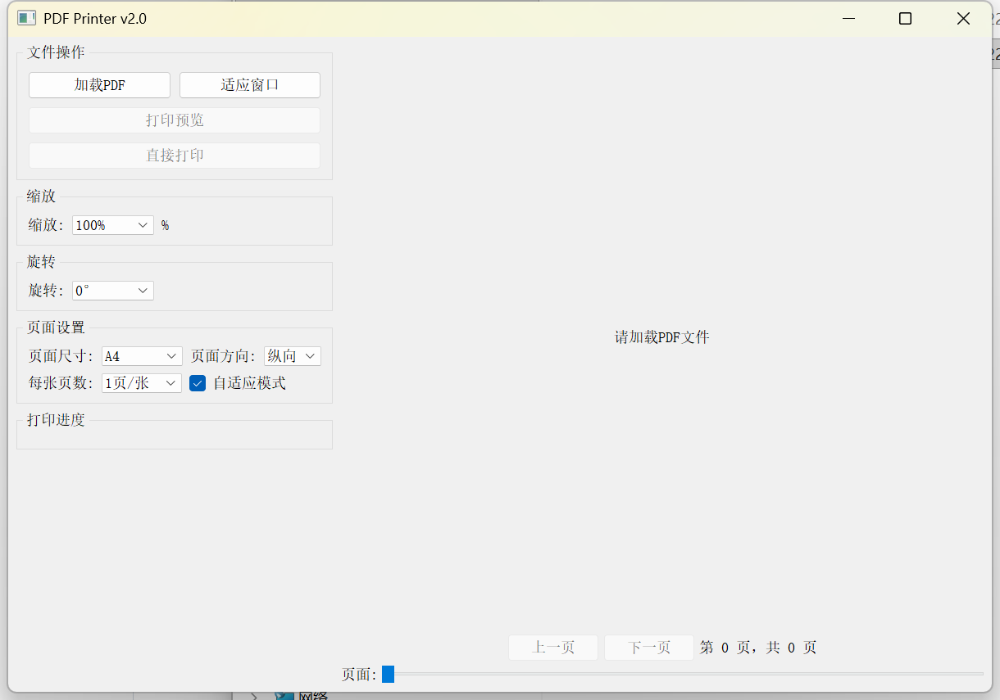

# PDF Printer Application v2.0

## 项目概述

这是一个功能完整的PDF打印和查看应用程序，基于PyQt5和PyMuPDF开发。该应用程序提供了丰富的PDF处理功能，包括查看、缩放、旋转、打印等。

## 功能特性

### 基本功能

- PDF文件加载和查看
- 多种缩放选项（25%, 50%, 75%, 100%, 125%, 150%, 200%, 自定义）
- 页面旋转（0°, 90°, 180°, 270°）
- 页面尺寸设置（A0-A6, Letter, Legal, Tabloid）
- 页面方向设置（纵向, 横向）
- 多页布局（1, 2, 4, 6, 9, 16页/张）
- 自适应模式显示
- 页面导航（上一页, 下一页, 滚动条）

### 打印功能

- 直接打印
- 打印预览
- 打印进度条显示
- 适应窗口显示功能

## 项目结构

```
pdf_printer/
├── pdf_printer.py         # 主程序入口
├── main.py                 # 主应用程序类
├── ui_handler.py           # 用户界面处理
├── pdf_handler.py          # PDF文件处理
├── scaling_handler.py      # 缩放功能处理
├── page_size_handler.py    # 页面尺寸处理
├── layout_handler.py       # 页面布局处理
├── print_handler.py        # 打印功能处理
├── layout_drawer.py        # 布局绘制处理
├── display_handler.py      # 显示处理
└── display_refresher.py    # 显示刷新处理
```

## 安装依赖

```bash
pip install PyQt5 PyMuPDF
```

## 使用方法

1. 运行应用程序：
   
   ```bash
   python main.py
   ```

2. 点击"加载PDF"按钮选择要查看的PDF文件

3. 使用各种控件调整PDF显示效果

4. 点击"打印"或"打印预览"进行打印操作

## 示例截图



## 打包为可执行文件

### Windows

1. 使用提供的批处理脚本：
   
   ```cmd
   build_windows.bat
   ```

2. 或者手动打包：
   
   ```cmd
   pip install pyinstaller
   pyinstaller --noconfirm --windowed --icon=pdf_icon.ico --name=pdf_printer main.py
   ```

### macOS

1. 使用提供的shell脚本：
   
   ```bash
   chmod +x build_macos.sh
   ./build_macos.sh
   ```

2. 或者手动打包：
   
   ```bash
   pip3 install pyinstaller
   pyinstaller --noconfirm --windowed --icon=pdf_icon.icns --name=pdf_printer main.py
   ```

### 打包文件位置

- Windows: `dist/pdf_printer.exe`
- macOS: `dist/pdf_printer.app`

### 注意事项

1. 图标文件需要单独创建：
   
   - Windows: `pdf_icon.ico`
   - macOS: `pdf_icon.icns`

2. 如果需要添加图标，请确保图标文件存在于项目目录中。

## 功能说明

### 缩放功能

- 控制原始PDF页面在渲染时的大小
- 影响PDF页面内容在新PDF页面上的排布比例
- 通过缩放下拉框和自定义输入控制

### 适应窗口功能

- 控制已渲染的PDF页面在GUI窗口中的显示大小
- 不影响PDF内容的渲染缩放比例
- 通过独立的按钮触发，仅调整显示时的视觉效果

## 版本历史

### v2.0 (2025)

- 优化UI布局（左右布局）
- 增加打印进度条
- 完善适应窗口功能
- 代码模块化和版本管理

### v1.0 (2024)

- 初始版本发布
- 基本PDF查看和打印功能

## 许可证

版权所有 (c) 2025

本软件及其源代码仅供学习和研究目的使用，未经授权禁止任何形式的商业使用。

禁止条款：

1. 禁止将本软件用于任何商业目的
2. 禁止将本软件或其衍生作品进行商业化分发
3. 禁止将本软件用于任何营利性活动

个人使用条款：

1. 允许个人用户免费使用本软件
2. 允许个人用户修改源代码用于学习目的
3. 允许在非商业环境中使用本软件

如需商业使用授权，请联系版权所有者获得书面许可。

本软件按"现状"提供，不提供任何明示或暗示的担保。